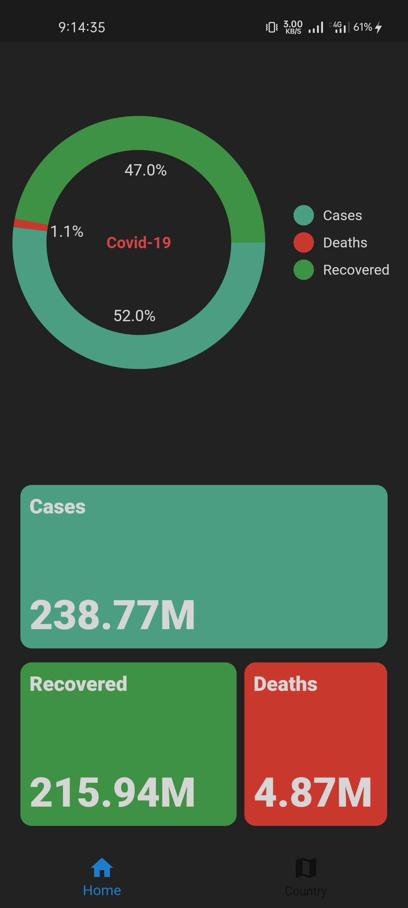
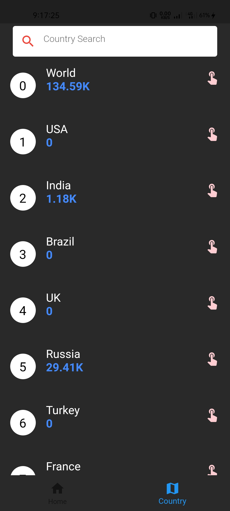
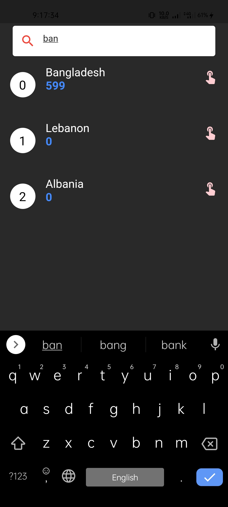
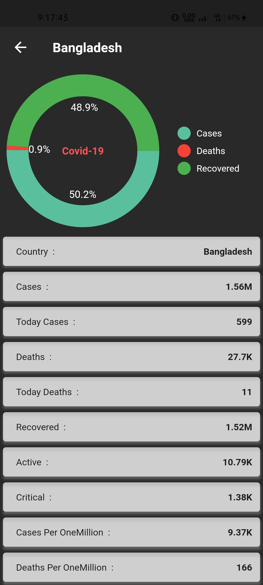

# covid19
Welcome to my Covid 19 application. With this we can see the update information of Covid-19
<!DOCTYPE html>
<html>
<body>

 1. World Wide information with Pie-Chart

 2. All Country List

 3. Search Country with country name

 4. Country information with Pie-Chart

</body>
</html>

